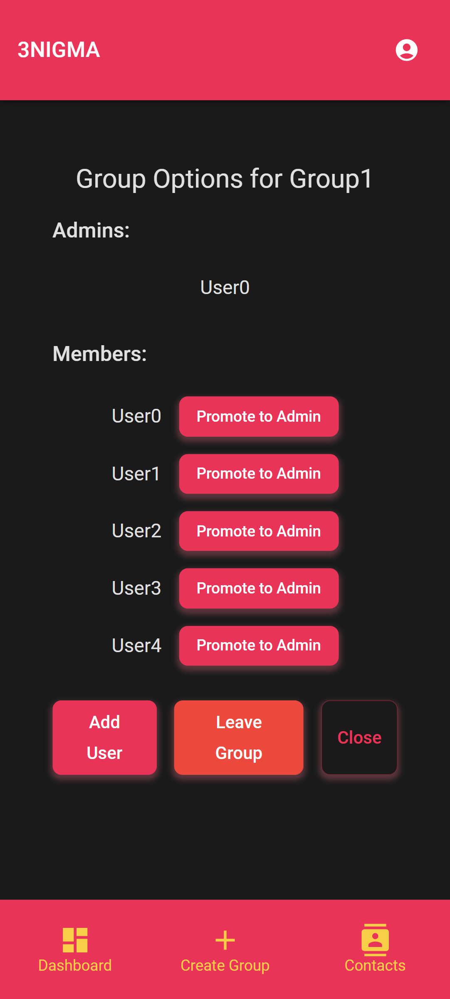
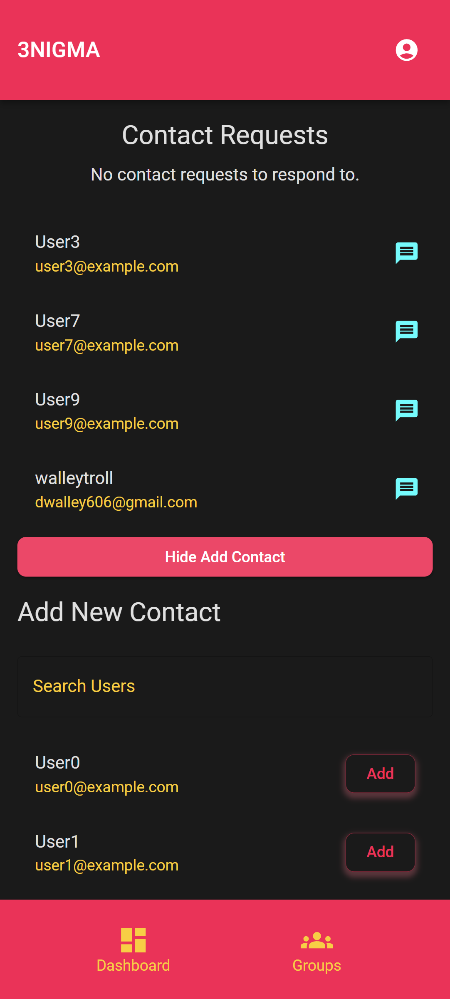

# 3NIGMA

[](https://opensource.org/licenses/MIT)

## Description
Welcome to my first full stack app, 3NIGMA. After recently graduating the flex coding bootcamp through George Washington University and EdX, I decided to set out building a full stack application that I could use to both hone my skills and display what I have learned. Being particularly security minded, I decided I would explore what it takes to build an end-to-end encrypted messaging app, and if possible utilize progressive web app techniques for ease of use. 

Please keep in mind this app is still in development and has limited features. **MESSAGES ARE NOT ENCRYPTED AT THIS TIME**. 

## Table of Contents

1. [Technologies Used](#technologies-used)
2. [Installation](#installation)
3. [Usage](#usage)
4. [License](#license)
5. [Contributing](#contributing)
6. [Tests](#tests)
7. [Questions](#questions)

## Technologies Used
- MongoDB
- Express.js
- React.js
- Node.js
- Material UI

Plans for development:
- Websocket(socket.io)
- HTTPS
- Progressive Web App (PWA) features
- End-to-end encryption

## Installation

To run 3NIGMA locally, ensure you have Node.js and MongoDB installed on your machine. Follow these steps:

1. **Clone the Repository**

   Clone the repository to your local machine using the following command:

   ```bash
   git clone https://github.com/dwalley606/3NIGMA.git
   ```

2. **Install Dependencies**

   Navigate to the project directory and install the necessary dependencies:

   ```bash
   cd 3NIGMA
   npm install
   ```

3. **Seed the Database (Optional)**

   To populate the database with sample data, run the seed script:

   ```bash
   npm run seed
   ```

4. **Start the Application**

   Launch the development server to start the application:

   ```bash
   npm run develop
   ```

   The app should now be running locally. Open your browser and navigate to `http://localhost:3000` to access it.

## Usage
To access the live deployment, click here: [Link to Render](https://threenigma.onrender.com)

In order to use the app, you will have to sign up with an email, password, and phone number. The functionality of the app doesn't depend on email or SMS communication yet, so feel free to use a fake email. Please remember your password, they are hashed on the db. 

In order to send a message, simply navigate to the contacts page and click "Add Contact" to see the users currently signed up. Feel free to add my username 'walleytroll' as a contact, and I will respond as soon as I am able.


<p align="center" style="display: flex; justify-content: space-around;">
  
  
</p>

## License
This project is covered under the MIT license. For more information, click the link below.
[License Link](https://opensource.org/licenses/MIT)

## Contributing
As of November 2024, I am the sole contributor to this project. If you'd like to contribute, have comments or recommendations, or would like to speak about collaborating in the future, please find my contact information below.

## Tests
Currently, there are no tests written, but I plan to implement a full suite of unit tests using Jest and explore more robust testing options.

## Questions
Have questions about this project? Please visit my [GitHub profile](https://github.com/dwalley606).

You can also send me an email at dwalley606@gmail.com.
